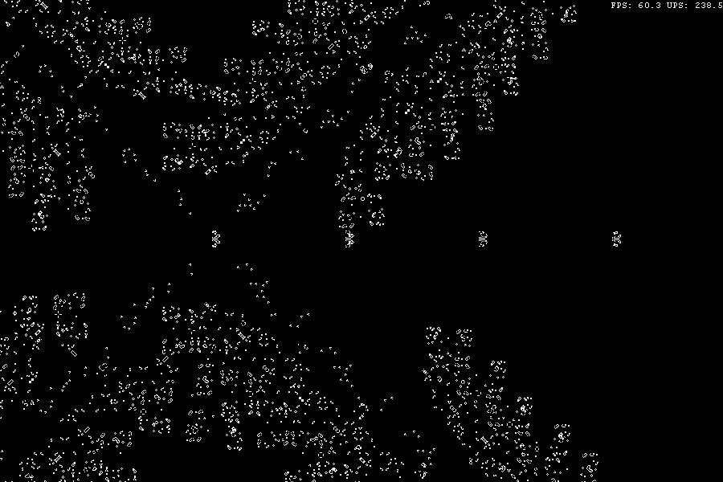
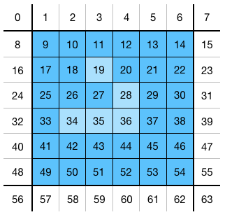
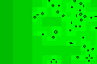

# BaGoL
Game of Life simulator based on quadtree datastructure. 

---

## Dynamically constructed quadtree

The simulation is based on a dynamically constructure quadtree. The tree expands
 and shrinks based locations of living cells. In the gif below, a debug view 
displays the way the tree changes because of an exploding r-pentomino. 

Nodes of the tree are displayed using different shades of
 green depending on their level. Darker indicates higher level nodes. As the 
living cells spread, higher levels of the tree are added. When parts of the tree
 do not contain any live cells anymore, they are removed.

---

## Cell representation
Cells are not represented individually. The lowest level representation is a 64 
bit integer (long long) which represents a bock of 6x6 cells including its 
neighbours.

This image shows all cells represented by one 64 bit value. The blue cells are 
the inner cells, the white cells represent the cells on the edges of 
neighbouring blocks. This is done such that it is not neccesary to call for 
information from neighbouring blocks to calculate the next state.

---

## Optimization

Parts of the tree that don't change should not be calculated again, but simply 
be static till an outside influence may change its state. Since two generations 
are kept in memory (the current one and the next one), all blocks which have 
repeating patterns with period of one (static) or two (blinking) do not need any
 computations.

Only for blocks which are rendered with a white background are new generations 
computed. You can see that parts of the tree, even though they contain live 
cells and even blinkers, are completely ignored.

---

## Pattern loading

To ease the loading of patterns, there is a rle file parser. Based on the 
specification described on the 
[wiki](http://www.conwaylife.com/wiki/Run_Length_Encoded). Some patterns are 
included in this repository in /patterns.

---

## Compiling

Currently, only linux is supported. Compiling can be done using the makefile. No 
libraries used except for SDL2 and SDL2_TTF for window management, 
multithreading and rendering. These can be downloaded from 
[here](https://www.libsdl.org/download-2.0.php) and
[here](https://www.libsdl.org/projects/SDL_ttf/) respectively.
